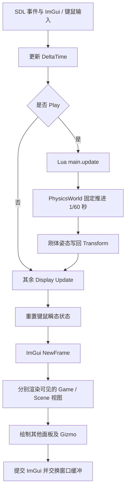

# Engine-Demo 实现说明

本说明根据上一轮对项目的分析记录恢复，分析日期为 2026-09-11。覆盖自研 C++、Lua、GLSL、场景 JSON 和 Visual Studio 工程配置，以及一次 Debug x64 构建检查。文中描述当前接入主流程的实现，并区分遗留接口与未接入功能。分析期间未修改引擎源码，也未启动图形程序验证视觉效果。

2026-09-11 面试准备复核：当前 Geometry、Lighting、SSAO shader 已声明 sampler 的 `layout(binding=...)`，Lighting 的 `diable_SSAO` 也与 C++ 调用一致。已更正下文相关旧结论；其余历史构建结果不代表本次重新验证。

项目是 Windows / C++20 / OpenGL 4.5 的 3D 引擎与可视化编辑器原型。解决方案仍名为 `The 2D Engine`，实际主流程已经包含 3D 延迟 PBR 渲染、ReactPhysics3D 刚体物理和 Lua 游戏脚本。编辑器同时承担引擎启动、服务装配和运行调度。

## 1. 代码地图与依赖

上次统计的自研 C++ 头文件、源文件及内联文件共 156 个，约 14,437 行（含空行与注释，排除第三方内嵌图标产物）；另有 13 个 Lua 文件和 29 个 shader 文件。当时目录内未发现 `.git` 元数据。

| 模块 | 职责 | 代表入口 |
| --- | --- | --- |
| EDITOR | 初始化、主循环、面板、场景操作 | [Application.cpp](EDITOR/src/Application.cpp) |
| CORE/ECS | EnTT 实体、组件、反射 | [Entity.inl](CORE/Core/ECS/Entity.inl) |
| CORE/Systems | 渲染、灯光、物理同步、Lua 调度 | [RenderSystem.cpp](CORE/Core/Systems/RenderSystem.cpp) |
| CORE/Resources、Buffers | 按名称管理资产和 GPU 缓冲 | [AssetManager.cpp](CORE/Core/Resources/AssetManager.cpp) |
| RENDERING | 相机、网格、模型、纹理、shader、FBO、UBO | [ModelLoader.cpp](RENDERING/Rendering/Essentials/ModelLoader.cpp) |
| PHYSICS | RP3D 工厂、销毁封装、碰撞用户数据 | [RP3D_Wrappers.h](PHYSICS/Physics/RP3D_Wrappers.h) |
| WINDOW | SDL 窗口与键鼠输入 | [Keyboard.cpp](WINDOW/Windowing/Inputs/Keyboard.cpp) |
| SOUNDS | SDL_mixer 音乐与音效 | [MusicPlayer.cpp](SOUNDS/Sounds/MusicPlayer/MusicPlayer.cpp) |
| FILESYSTEM | 文件对话框、JSON 序列化 | [JSONSerializer.cpp](FILESYSTEM/FileSystem/Serializers/JSONSerializer.cpp) |
| UTILITIES、LOGGER | Timer、删除器、容器工具、日志 | [Logger.inl](LOGGER/Logger/Logger.inl) |
| 游戏资产 | Demo 脚本、资源及场景数据 | [main.lua](EDITOR/assets/scripts/main.lua) |

主要依赖为 SDL2、SDL_mixer、GLAD、GLM、EnTT、Lua 5.3、sol3、ReactPhysics3D、Assimp、stb_image、RapidJSON、ImGui、ImGuizmo 和 tinyfiledialogs。分析覆盖自研调用关系，不包含逐行审查第三方库内部实现。

Debug x64 配置下，EDITOR 是可执行程序，主要模块作为静态库链接。CORE 负责上层调度，RENDERING 提供底层图形对象，但工程大量使用全局服务，模块之间并非完全隔离。

## 2. 全局服务与场景数据的所有权

`MAIN_REGISTRY()` 内部持有 `unique_ptr<Registry>`，其 `entt::registry::ctx` 保存 AssetManager、BufferManager、MusicPlayer、SoundFxPlayer 等服务。Application 进一步加入 RenderSystem、LightSystem 和 DisplayHolder。

`SCENE_MANAGER()` 管理 `map<string, shared_ptr<SceneObject>>` 和当前场景名称。SceneObject 声明了 `m_Registry`、`m_RuntimeRegistry`，但 Game、Scene、Lua、物理和保存操作实际均使用 `GetRegistry()`。运行时副本机制尚未接入主流程。

场景激活时才加入 Camera3D、PhysicsCommon、PhysicsWorld、ContactListener、PhysicsSystem、ScriptingSystem 和 `sol::state` 等 context。SceneDisplay 另外持有独立的编辑器相机，Game 视图使用场景相机。

`CORE_GLOBALS()` 保存帧间隔、窗口信息及物理开关、时间步长等；`TOOL_CTX()` 保存选中实体和 Gizmo 模式。部分 enable/pause 状态虽有声明，主模拟分支并未检查。

## 3. 启动和场景激活流程

程序从 `main.cpp` 进入 `Application::GetInstance().Run()`，依次完成：

1. 初始化日志、SDL、OpenGL 4.5 Core 最大化窗口、GLAD 和垂直同步。
2. 设置深度测试、背面剔除、混合、模板状态，初始化 ImGui docking 和多视口。
3. 装配全局服务，创建 RenderSystem 和容量为四个方向光、四个点光的 LightSystem。
4. 创建 Game、Scene、Logs、Asset、Menu、SceneHierarchy 六类面板；GO Details 由 Hierarchy 绘制。
5. 加载默认几何、14 组 shader、图标、天空盒、HDR 和噪声纹理。
6. 准备 framebuffer、G-buffer、SSAO、阴影、UBO，执行 IBL 预计算。
7. 注册界面及 `scene1`、`scene2`，启动后默认没有激活场景。

用户将 Asset 面板的 SCENE 拖入 Scene 面板后，先设置当前场景，再进入 [SceneDisplay.cpp](EDITOR/src/editor/displays/SceneDisplay.cpp) 的 `LoadScnne`。该流程装配场景 context，并加载固定入口 `assets/scripts/main.lua`。

脚本加载时就导入资源、播放音乐、创建玩家与 Demo 实体，无需等待 Play。场景没有独立的脚本入口配置，因此两个场景都从同一份 Demo 脚本初始化。

重复拖入同一场景没有完整的加载守卫、清空或重置流程，可能重复创建实体、遇到资源重名，并产生多个 `main_script` 实体。

## 4. 一帧实际如何执行



Lua 更新发生在输入 Reset 之前，所以 `just_pressed` 能读取本帧事件。Scene 相机通过 ImGui 输入处理右键旋转和方向键移动。

Play 会将 Transform 推入刚体并重置前后姿态记录，但没有完整清理刚体速度。Stop 主要修改运行标记；恢复场景、停止音乐等逻辑未形成完整流程，部分代码处于注释状态。因此编辑和运行共享同一份场景，停止不会恢复运行前的状态。

物理 accumulator 与插值流程被注释。当前每个应用帧调用一次 `update(1/60)`，PhysicsSystem 忽略插值因子并直接读取当前姿态。因此模拟速度取决于应用帧率，不是按真实时间累计的固定步进。

跟随相机在物理更新前读取 Transform，使用上一轮写回的物理姿态；脚本读取碰撞列表也受到 Lua 先于本帧物理更新这一时序影响。

## 5. ECS、组件与反射

Registry 是 EnTT registry 的薄封装。Entity 保存 Registry 引用、实体 ID 和 name/group 缓存；新建实体时加入 Identification。Entity 包装对象析构不会自动 Kill 实体；修改 Identification 后，已有包装对象缓存的名称可能不会同步。

| 组件 | 数据及实际用途 |
| --- | --- |
| Identification | name、group、id、parent、selected；父级关系仅部分功能使用，未保存 |
| Transform | 位置、缩放、Euler、四元数；渲染使用四元数，界面编辑 Euler |
| MeshFilter | 模型资产名称、changed 标志 |
| MeshRender | shouldRender、flipUV、逐网格材质；主渲染路径使用固定延迟 shader |
| Physics | 物理参数、刚体、形状、Collider、用户数据、前后姿态 |
| Light | 灯光参数；位置独立于 Transform |
| Script | update/render 回调；当前集中用于 main_script |
| CubeCollider、SphereCollider | 遗留简单参数组件，虽绑定 Lua，但不构成当前 RP3D 物理流程 |

EnTT meta 的 `type_id` 是 Lua 调用组件模板操作和编辑器组件 UI 的桥梁，runtime_view 也借助 meta。新增组件通常要分别维护 C++ 类型、Entity meta、Registry meta、Lua、界面和 JSON 注册，不能只增加一个结构体。

模型矩阵由 `T * R * S` 组成。存在父级时仅左乘直接父级变换，不递归累计祖先，也不检测父级环。Hierarchy 实际是平铺列表，Gizmo 没有完整的父级世界坐标补偿。

`CopySceneToRuntime` 未被当前运行流程调用。如果后续接入，需处理实体 ID 与父级映射、Identification 的复制反射，以及 Physics 的深拷贝；直接复制其 shared_ptr 会共享物理对象。

## 6. 渲染管线及 GPU 数据协议

实际入口为 [RenderSystem.cpp](CORE/Core/Systems/RenderSystem.cpp) 中的 `DeferredRenderPipeline`。Game 和 Scene 各自维护视图 framebuffer，但共享 UBO、阴影和 IBL 资源。

| 阶段 | 输入与输出 |
| --- | --- |
| Prepare | 更新相机、灯光及 UBO |
| Shadow | 从 ECS 绘制方向光深度纹理和点光深度 cubemap |
| Geometry | 输出世界位置、法线、albedo、MRA，并写入模板信息 |
| SSAO | 将世界空间数据转换到视图空间，用 64 个采样及 4×4 噪声估计遮蔽 |
| Blur | 对 SSAO 进行 4×4 模糊 |
| Lighting | 组合 PBR、灯光、阴影、IBL、AO/SSAO，并进行 Reinhard tone mapping 和 gamma 校正 |
| Postprocess | 拷贝深度/模板后叠加灯光标记、选中轮廓、天空盒和物理线框 |

四个 G-buffer 颜色附件均为 RGBA16F，shader 主要写 RGB。位置和法线位于世界空间，MRA 表示 metallic、roughness、AO。最终颜色纹理为 RGBA8，深度模板使用 DEPTH24_STENCIL8，SSAO 使用 R8。

Geometry 遍历包含 Transform、MeshFilter、MeshRender、Identification 的实体，检查 shouldRender；模型缺失时存在默认立方体回退路径。模型变化或材质列表为空时会 ResetMaterial。绘制按模型中的 mesh 逐个提交，没有接入实例批处理、视锥裁剪或完整透明排序。

PBR 使用 GGX、Schlick、Smith 和 metallic/roughness 参数。直接光照与环境光照分开计算，AO/SSAO 作用于环境部分。方向光使用正交投影和 3×3 PCF；点光通过 geometry shader 输出 cubemap 六面，并用 20 个偏移进行阴影采样。

UBO 的绑定约定为：binding 0 保存两个相机矩阵；binding 1 保存四个方向光；binding 2 保存四个点光；binding 3 保存 64 个 vec4 SSAO 采样。LightSystem 每次清空固定大小数组，再填入当前灯光，避免删除灯光后的数据残留。

IBL 预计算位于 [Application.cpp](EDITOR/src/Application.cpp)：HDR 转为 512 环境 cubemap，生成 32 irradiance cubemap、128 prefilter cubemap 的五级 mip，以及 512 BRDF LUT，供 split-sum 环境光照使用。

Forward 管线仍存在，但属于未接入主路径的遗留实现。材质的 shadingModel 并不实际决定主流程使用哪个 shader。Postprocess 主要是叠加绘制，不代表已经实现 Bloom 或 TAA。

视口尺寸变化先设置脏标志，管线末尾 `CheckResize` 再重建资源，存在更新时序差。面板折叠会提前返回并停止该视图渲染；两个视图均可见时会重复执行阴影等工作。

## 7. 模型、贴图和材质加载

AssetManager 用名称到 shared_ptr 的 map 管理模型、纹理、shader、音乐和音效，组件通过字符串引用资产。编辑器标志用于隐藏内置资源；没有 UUID、依赖图或独立导入数据库。

Assimp 加载 OBJ、FBX、glTF、GLB 等模型，启用三角化、平滑法线、UV 翻转及切线生成等选项。`processNode` 递归收集 mesh，但未应用节点变换，也没有接入骨骼动画。纹理以目录及文件 stem 组合命名，主要处理外部纹理路径，未实现嵌入纹理解码。因此扩展名白名单不意味着支持格式的全部能力；编辑器导入界面主要限制为 OBJ。

Mesh 保存 CPU 顶点/索引及 VAO、VBO、EBO，使用 DSA 与 immutable storage；顶点包含位置、法线、UV、切线和副切线。Mesh 禁止复制，通过移动转移资源所有权。一个 Model 可包含多个 mesh，材质与 mesh 按下标对应。

TextureRegistry 将 Assimp 和界面材质操作统一到五个纹理槽。Texture 工厂覆盖普通图片、HDR 和离屏纹理。普通图片路径通过 UTF-8 filesystem 和内存解码处理，但 HDR、天空盒路径没有全面统一到同一种处理方式。

## 8. 物理、碰撞和游戏逻辑

Physics 初始化根据 PhysicsAttributes 创建刚体、box/sphere/capsule 形状及 Collider，设置质量、重力、阻尼、轴锁定、摩擦、弹性和 trigger。Collider 局部变换为 identity，渲染 Transform 的 scale 不会自动修改碰撞形状尺寸。

RP3D 对象通过带自定义删除器的 shared_ptr 封装：world 持有 common，body 持有 world，collider 持有 body，shape 持有 common，最终调用对应 destroy/remove API。详情面板 Apply 会重建形状与 collider；首次 Physics 初始化也发生在详情面板 Draw 逻辑中。

ContactListener 将接触和重叠的 start/exit 事件映射到 body userData 中的 `any<ObjectData>`，维护双方 contactEntities 和碰撞对，再暴露给 Lua。contactEntities 存储值副本，`get_user_data` 返回的也不是可直接修改原对象的实时引用。

`utilities.lua` 中的 LoadEntity 根据 Defs 创建组件。Demo 包括胶囊玩家及子物体、往返平台、刚体地面和墙、触发器、两个模型、五个材质球、四个点光和一个方向光。

玩家 WASD 施加局部力，Q/E 施加扭矩，Space 施力并播放音效，F 发射子弹。部分命名为 impulse 的封装实际调用 force/torque。触发器改变颜色，平台沿 Z 轴往返，子弹由计时器删除；伤害逻辑仍有 TODO。

ScriptingSystem 将 `main[1].update` 和 `main[2].render` 绑定到 `main_script`。主流程仅调用 Update，Render 尚未接入。这是集中式主脚本手动调度，并非每个实体独立执行行为脚本；更新中还会触发 Lua GC。

StateMachine 和 StateStack 已暴露给 Lua，但 Demo 没有使用它们。controller 中存在 default_state 字段，也不表示状态机已经参与运行。

## 9. 编辑器操作与持久化

Hierarchy 提供实体创建、删除、选择和组件操作，组件详情通过反射分派 UI。selected 参与模板轮廓渲染，ToolContext 驱动 Gizmo，操作结果分解为位置、缩放、四元数和 Euler。

Asset 面板提供分类、导入、改名、删除和拖放源。当前明确接收并处理的是场景拖入；其他资产存在拖放源并不意味着已实现拖入场景自动创建对象。空类别提前 return，可能导致添加按钮不可达。

资产改名主要修改 map key，不同步所有组件中的名称引用；场景改名也没有完整同步当前场景名称与对象内部名称。

File Open 将 JSON 实体追加到当前场景，不先清空，也不会重置 Lua 状态。Save 排除带 ScriptComponent 的实体，保存 Identification、Transform、MeshFilter、MeshRender、Physics、Light 六类组件。

保存内容不包含父级、脚本、资产库、相机或场景 context，因此它是部分场景实体快照，并非完整项目存档。Physics 保存属性中的初始姿态，Transform 保存当前姿态，两者未同步时可能在重新加载后出现差异。

上次检查的样例 `test` 含 24 个实体，`pbr_balls` 含 49 个实体，JSON 语法解析通过。加载器多处直接取字段，缺少完整 schema 校验，也缺少完善的无当前场景处理。菜单 New/Exit 主要记录日志；快捷键文字不代表对应操作全部接入。

## 10. 其他基础设施

MusicPlayer 基于 SDL_mixer，以 44.1 kHz、立体声初始化，并配置 16 个混音通道；全局播放器将 0～100 音量换算到 SDL_mixer 的 128 刻度。Timer 使用 steady_clock，供脚本生命周期等逻辑使用。

Logger 支持 Windows 控制台颜色、内存日志和 source_location，Lua 侧使用 string.format。Logs 面板在有新日志时倒序重建显示内容，并提供 clipper、清空和复制。日志没有数量上限，因此逐帧产生的 uniform 错误可能同时增加内存和界面更新开销。

## 11. 已确认的实现问题与待验证影响

以下为上次静态代码检查发现的问题。涉及视觉结果、崩溃和性能的具体影响未通过 GUI 运行复现，不能把推测的表现视为已验证故障。

| 位置或机制 | 代码层面的发现与影响 |
| --- | --- |
| Application::LoadEditorTextures | 成功路径缺少 `return true`，返回值不可靠 |
| Geometry / Lighting / SSAO sampler（复核更正） | 当前 GLSL 已通过 `layout(binding=...)` 显式映射纹理单元，与 C++ 的 `glBindTextureUnit` 配合；不应继续将缺少 sampler 绑定列为当前故障 |
| SSAO 开关（复核更正） | 当前 C++ 与 Lighting shader 均使用 `diable_SSAO`；拼写虽不规范，但接口一致，旧版名称不一致的结论不再适用于当前代码 |
| Texture 生命周期 | Texture 未实现对应的 `glDeleteTextures` 释放；shared_ptr 销毁 CPU 对象不能释放 GPU texture，视口重建可能持续泄漏 |
| Play / Stop | 共用编辑场景，停止不恢复初始状态 |
| 物理步进 | 每个应用帧固定推进 1/60 秒，模拟速度与应用帧率耦合 |
| 材质查找 | 存在直接访问 `m_textures.find("albedo")->second` 的路径，默认 Material 扩容不保证键存在；删除资产后也有空指针解引用风险 |
| 父级关系 | 仅处理直接父级，不保存；`has_parent` 对 `-1` 的判断语义反向 |
| Lua 重力参数 | `enable_gravity or true` 会将显式 false 变成 true，子弹配置已有该用法 |
| 子弹速度 | 设置速度时额外乘 delta time，混淆速度与单帧位移 |
| IBL | 环境 cubemap 只分配一级 immutable mip，prefilter 却按多级 textureLod 采样；prefilter 中 GGX 分母计算也存在不一致 |
| 选中轮廓 | Postprocess 设置选中模型矩阵时未同步 normalMatrix，可能沿用之前灯光绘制状态 |
| 模型导入 | 未应用 Assimp 节点变换，未解码嵌入纹理 |
| Cleanup | 主要调用 SDL_Quit，缺少完整的 ImGui、GPU 对象、GL context、窗口、SDL 销毁顺序；部分静态对象析构更晚 |

另有未接入主 Demo 的问题：StateStack 仅在 on_enter 有效时清理待处理 holder，缺少 enter 时可能重复 push；StateMachine 的 enterParams 未被使用；Physics 的某个 Lua table 分支读取 entity ID 时使用 tag 字段，Demo 走的是另一分支。

物理生命周期还需要专门验证：Listener 使用原始 userData 指针，Physics 成员析构顺序可能使用户数据早于 body 消失；Lua 持有数据副本以及碰撞回调期间删除实体也会增加生命周期复杂性。目前这些是风险分析，未复现为具体崩溃。

## 12. 构建与验证结论

**2026-09-12 更新：**已修复 x64 工程的 Debug/Release 配置差异，并准备对应的 Release 第三方依赖，完整 Release 解决方案已编译通过。当前构建步骤与验证记录见 [BUILDING.md](BUILDING.md)。下文保留 2026-09-11 的历史检查过程，不再代表当前 Release 构建状态。

工程使用 Visual Studio 2022、v143、C++20，依赖随目录提供。不同 Configuration/Platform 的设置不对称，不能由 Debug x64 推断 Release 或 Win32 可构建。

上次在项目根目录尝试的构建命令：

```powershell
& 'D:\VisualStudio\2022\MSBuild\Current\Bin\MSBuild.exe' 'The 2D Engine.sln' /t:Build /p:Configuration=Debug /p:Platform=x64 /m:2 /nologo /v:quiet /clp:ErrorsOnly
```

第一次受到沙箱内 SDK 访问限制；获得执行批准后重试，构建仍因 SOIL 的四个 C1083 错误失败，涉及 `SOIL/image_dxt.h`、`SOIL/image_helper.h`、`SOIL/SOIL.h`、`SOIL/stb_image_aug.h`。

CORE 仍引用 SOIL 工程，但 SOIL 未进入解决方案的完整配置映射。本次 SOIL 实际以 WIN32 参数编译，而相关 include path 仅配置在 x64 条件中。对应文件在目录中存在，因此判断为遗留工程配置问题；主纹理加载实现已经使用 stb_image。

目录中的旧 `x64/Debug/EDITOR.exe` 不能证明当前源码能够重新构建。程序大量使用相对 assets 路径，运行工作目录应为 EDITOR；SDL2、SDL_mixer、Assimp 等 DLL 在 EDITOR 目录而非统一部署到输出目录，尚未形成完整打包流程。

上次实际完成了代码调用链阅读、资源与场景数据检查、样例 JSON 解析和构建尝试；没有运行旧二进制，没有验证画面，也没有修复上述代码问题。本次恢复文档未重新执行构建。

## 13. 后续修改的定位与顺序

| 修改目标 | 优先阅读位置 |
| --- | --- |
| 初始化、服务、默认资源、GPU 预计算 | Application、MainRegistry |
| Play/Stop、时间步进、场景复制 | GameDisplay、SceneObject、PhysicsSystem |
| 场景激活、编辑相机、场景拖入 | SceneDisplay |
| 新增组件及 Lua 接口 | ECS、Entity/Registry meta、ScriptingSystem |
| PBR、SSAO、阴影、IBL | RenderSystem、GLSL、Framebuffer、Texture |
| 模型格式和导入 | ModelRegistry、ModelLoader、TextureRegistry、AssetManager、AssetDisplay |
| 属性面板与 Gizmo | ComponentDrawer、Hierarchy、ImGuiUtils、ToolContext |
| 保存与加载 | [SceneLoader](CORE/Core/Loaders/SceneLoader.cpp)、ComponentSerializer、JSONSerializer |
| Demo 游戏行为 | main.lua、GameDemo、Defs |

建议先处理构建配置、初始化返回值和纹理释放，并验证 IBL 预过滤及各 pass 的渲染结果；随后处理物理时间步进、Play/Stop 语义和生命周期。sampler 绑定在本次复核的当前 shader 中已明确声明。

扩展功能时应沿实际调用链确认接入情况：存在运行时 Registry、状态机、脚本 render 或 parent 字段，并不代表已经具备完整场景隔离、状态驱动行为、脚本渲染或层级编辑能力。
